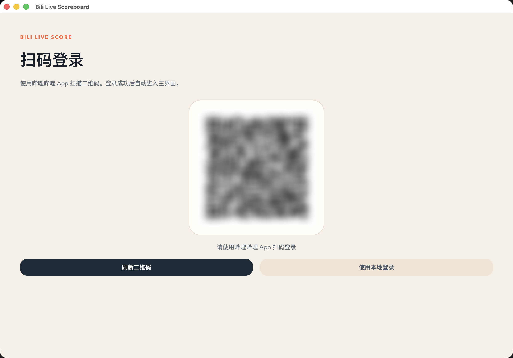
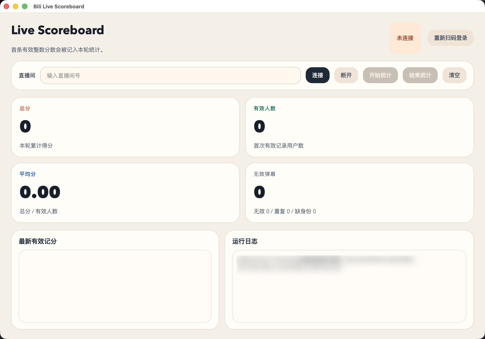

# bilibili 弹幕评分项目

一个基于 `bilibili-api-python` 的 Bilibili 直播弹幕评分工具。

项目目标是对指定直播间的实时弹幕进行监听，并按照“单 UID 首次有效整数评分”的规则完成一轮统计。当前同时提供：

- CLI 命令行计分器
- GUI 可视化界面
- 二维码登录工具
- 原始弹幕事件调试工具

## 功能概览

- 监听指定 B 站直播间弹幕
- 仅接受 `0-10` 的纯整数评分
- 同一 UID 只记录首次有效分数
- 无效弹幕不占用记分名额
- 支持二维码登录并保存本地凭据
- 支持命令行模式和桌面 GUI 模式
- 支持输出单轮统计结果

## 项目结构

```text
bili_dammaku_score/
├── data/
│   └── credential.json         # 登录成功后保存的本地凭据
├── img/
│   ├── 主界面.png
│   └── 登陆界面.png
├── scripts/
│   ├── bili_live_utils.py      # 凭据读取、弹幕解析、公用工具
│   ├── gui_app.py              # GUI 主程序
│   ├── login_qr.py             # CLI 二维码登录
│   ├── raw_event_printer.py    # 原始事件打印器
│   ├── score_cli.py            # CLI 计分器
│   └── score_core.py           # 计分核心逻辑
└── README.md
```

## 1. 环境安装依赖教程

### 运行环境建议

- macOS / Windows 均可运行
- Linux 理论可运行，但当前项目主要在 macOS 环境下完成开发与验证
- Python 3.13 或 3.14
- 已安装 `pip`

说明：

- 当前项目开发时使用的是本地虚拟环境 `venv`
- GUI 依赖 `PySide6`
- 直播监听依赖 `bilibili-api-python` + 异步请求库 `aiohttp`

### 方式一：直接使用项目现有虚拟环境

如果你已经拿到了本项目完整目录，并且 `venv` 已经可用，可直接运行：

```bash
./venv/bin/python scripts/gui_app.py
```

或：

```bash
./venv/bin/python scripts/score_cli.py 直播间号
```

### 方式二：从零创建虚拟环境

```bash
python3 -m venv venv
source venv/bin/activate
pip install --upgrade pip
pip install -r requirements.txt
```

安装完成后，建议先验证核心依赖是否正常：

```bash
python -c "import bilibili_api; import PySide6; print('ok')"
```

### Windows 环境安装示例

如果你在 Windows PowerShell 中安装，可参考：

```powershell
py -m venv venv
.\venv\Scripts\Activate.ps1
python -m pip install --upgrade pip
pip install -r requirements.txt
```

启动 GUI：

```powershell
python .\scripts\gui_app.py
```

启动 CLI：

```powershell
python .\scripts\score_cli.py 直播间号
```

### 可选调试命令

原始弹幕事件调试：

```bash
./venv/bin/python scripts/raw_event_printer.py 直播间号 --summary-only
```

二维码登录：

```bash
./venv/bin/python scripts/login_qr.py
```

## 2. 账号登录使用说明

### 为什么建议登录

如果匿名连接直播间，部分弹幕事件中可能拿不到真实 UID。

项目的核心规则是“同一 UID 只记录首次有效分数”，因此建议始终使用登录态运行。登录后，弹幕事件中通常可以稳定拿到：

- `uid`
- `uname`
- 弹幕文本

### 登录方式一：GUI 扫码登录

直接运行 GUI：

```bash
./venv/bin/python scripts/gui_app.py
```

首次启动如果没有本地凭据，会自动进入扫码登录页：

1. 打开 B 站 App
2. 扫描界面二维码
3. 在手机上确认登录
4. 登录成功后自动进入主界面

### 登录方式二：CLI 二维码登录

如果你暂时不想先打开 GUI，也可以先在命令行完成登录：

```bash
./venv/bin/python scripts/login_qr.py
```

登录成功后，凭据将保存到：

```text
data/credential.json
```

后续 CLI 和 GUI 都会优先读取该文件，无需每次重新扫码。

### 凭据说明

本项目当前默认使用本地文件保存登录凭据：

- 文件路径：`data/credential.json`
- 已在 `.gitignore` 中忽略

注意事项：

- 不要将 `data/credential.json` 上传到 Git 仓库
- 不要分享给他人
- 凭据过期后，需要重新扫码登录

## 3. CLI 命令行使用指南

CLI 计分器脚本：

```bash
./venv/bin/python scripts/score_cli.py 直播间号
```

示例：

```bash
./venv/bin/python scripts/score_cli.py 5895809
```

### CLI 工作流程

1. 启动脚本并连接直播间
2. 输入 `start` 开始一轮统计
3. 在直播间中发送弹幕评分
4. 输入 `stop` 结束统计并输出报告
5. 输入 `quit` 退出程序

### 可用命令

- `start`
  开始一轮新的统计，并清空当前计分
- `stop`
  停止统计，并输出本轮统计结果
- `status`
  查看当前统计状态
- `reset`
  清空当前统计，但不自动开始
- `help`
  显示命令帮助
- `quit`
  退出程序

### 计分规则

- 只接受 `0-10` 的纯整数
- 会先对弹幕内容执行 `strip()`
- `8`、`10` 有效
- `08`、`8分`、` 8.5 `、`哈哈`、表情弹幕无效
- 同一 UID 仅首条有效评分生效
- 首次无效弹幕不会锁死该 UID，后续首次有效整数仍可记分

### CLI 输出内容

单轮统计结束后会输出：

- 开始时间
- 结束时间
- 有效人数
- 总分
- 平均分
- 收到弹幕总数
- 无效弹幕数
- 重复用户弹幕数
- 缺少身份标识的弹幕数
- 每位有效记分用户的明细

## 4. GUI 可视化界面介绍

GUI 主程序：

```bash
./venv/bin/python scripts/gui_app.py
```

也可以直接指定初始房间号：

```bash
./venv/bin/python scripts/gui_app.py --room-id 5895809
```

### 登录界面

GUI 首次启动且本地无凭据时，会进入扫码登录页。

功能特点：

- 自动生成二维码
- 显示当前扫码状态
- 登录成功后自动进入主界面
- 如果已存在本地凭据，可直接进入主界面



### 主界面

主界面用于房间连接、统计控制和实时查看结果。

当前界面包含：

- 房间号输入框
- 连接 / 断开按钮
- 开始统计 / 结束统计 / 清空按钮
- 总分、有效人数、平均分、忽略计数四个动态卡片
- 最新有效记分列表
- 运行日志区
- 重新扫码登录入口



### GUI 使用流程

1. 启动 GUI
2. 扫码登录，或直接使用已有本地登录态
3. 输入直播间号并点击“连接”
4. 点击“开始统计”
5. 等待用户发送 `0-10` 的整数弹幕
6. 点击“结束统计”
7. 查看本轮统计结果弹窗

## 5. 项目现有功能限制 & 已知缺陷 & 后续优化方向

### 现有功能限制

- 目前只支持单直播间监听
- 目前只支持单轮手动开始、手动结束统计
- 结果默认只显示在 CLI 输出或 GUI 弹窗中，未持久化保存到数据库
- 评分规则固定为 `0-10` 整数，尚未支持自定义区间、自定义权重或投票模式
- 当前主要面向个人本地使用，未做多人协作或远程部署能力

### 已知缺陷

- 项目依赖 B 站直播弹幕接口与 `bilibili-api-python`，如果上游接口调整，监听逻辑可能失效
- 凭据失效后需要重新扫码登录
- 匿名连接时，部分场景下可能拿不到真实 UID，只能退化为按 `user_hash` 去重
- 当前 GUI 尚未做安装包封装，需要通过 Python 命令启动
- 当前统计结果未导出为 CSV、JSON 或 Excel
- 当前没有自动重连成功后的会话恢复策略，断线期间的弹幕不会补采
- 当前没有针对大规模高并发弹幕场景做专门压测

### 后续优化方向

- 增加统计结果导出功能
  - CSV
  - JSON
  - Excel
- 增加本地数据库存储
  - 保存每轮统计记录
  - 支持历史查询
- 增加自定义评分规则
  - 自定义分值区间
  - 自定义有效格式
  - 自定义去重策略
- 增加多房间支持
- 增加更完整的异常处理和自动重连恢复
- 增加 GUI 的主题切换与更细致的动效
- 增加打包发布
  - macOS App
  - Windows 可执行文件
- 增加单元测试与集成测试

## 开发调试建议

如果你想先确认某个直播间弹幕 payload 结构，可使用：

```bash
./venv/bin/python scripts/raw_event_printer.py 直播间号 --summary-only
```

如果你想排查更底层的原始事件，可使用：

```bash
./venv/bin/python scripts/raw_event_printer.py 直播间号 --all
```

## 免责声明

本项目仅用于学习、研究和个人工具化使用。

- 请勿将凭据泄露给他人
- 请勿将项目用于违规、恶意刷屏、骚扰或其他不当用途
- 请遵守 Bilibili 平台规则以及相关法律法规
